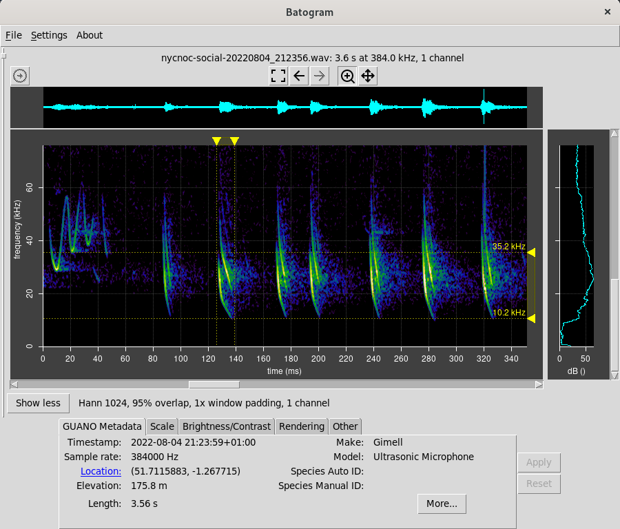

Batogram
========

Batogram is an open source application for viewing bat call spectrograms.

Some capabilities and features: 
* Rendering of spectrograms from .wav files.
* Audio playback: direct, heterodyne and time division, write to .wav file.
* Auto selection of many parameters for simple operation.
* Efficient rendering with graceful handling of larger data files.
* Pan and scale using the mouse, keys or by manual selection.
* Graphical markers allow time and frequency ranges to be conveniently read.
* Handling of multichannel data files, including stereo.
* Ability to correct for microphone frequency response.
* Basic side by side comparison of two spectrograms.
* Support for reassignment spectrograms for increased resolution.
* Display of GUANO metadata, including the ability to click to open the location in Google Maps.
* Runs on Windows, Linux operating systems, maybe macOS.

Installation
------------

### Windows

There are currently two approaches to installing Batogram on Windows. The first and simplest
method is as follows:

* Download a Batogram executable for Windows from Github. Available releases are listed 
[here](https://github.com/jmears63/batogram/releases). You need the file named batogram.exe, listed
under Assets.
* Probably Windows Defender will warn you of the danger of downloading such files from unknown
sources. Assess the risk and decide if you going ahead. Assuming you are, proceed to the
next step.
* Copy the downloaded executable to your Windows desktop, so that you can find it when you want it.
* Double click it on the desktop to run it. The first time you run it, it will take a little longer to start 
up than usual. You will notice a command window launched alongside Batogram - ignore it. This is to
aid debugging, and will be removed in a future release.

The second installation method is to install Python on your Windows computer, and then follow the 
same steps as the Linux installation. If you take this route, I assume you know what you are doing.

### Linux

On Linux, Batogram is currently installed from the command line using pip, as below.
You need to have Python 3.9 as a minimum.  

    # Create a virtual environment at a convenient location in your home directory:
    mkdir ~/batogram
    cd batogram
    python3 -m venv venv
    source venv/bin/activate

    # It's good practice to have pip up to date:
    pip install pip --upgrade

    # You may need to install some dependencies. On fedora it looks as follows.
    # More information on pyaudio installation here: https://people.csail.mit.edu/hubert/pyaudio/
    sudo dnf install python3-devel gcc portaudio-devel python3-tkinter

    # Install batogram and its dependencies. This may take a few moments.
    pip install batogram
    
    # Batogram is now in PATH. You can run it with this simple command:
    batogram

### macOS (experimental)

It should be possible to follow the same steps as the Linux installation to install and run
batogram. However, I am not an expert on Apple products, and don't have any macOS systems to
test this on.

Usage
-----

Refer to files in the docs directory for more information. In particular, see
[batogram.md](docs/batogram.md) for usage notes.

Licence
-------

This project is licensed under the MIT License - see the LICENSE file for details.

Contributing
------------

I welcome bug reports, and requests for minor improvements and major new features.
Please submit these via github. I will prioritize them and get to them when I can.

I also welcome sample .wav files containing representative bat calls of different species.
My hope this that this will grow into a useful collection of reference calls for comparison.

For the moment, while the structure of the code is fairly rapid flux, so I am not accepting
pull requests other than for small fixes. This may change in the future.

Credits
-------

In no particular order:
* [Pictogrammers Team](https://www.iconarchive.com/show/material-icons-by-pictogrammers/bat-icon.html) for the application icon.
* [Tucker Beck](https://code.activestate.com/recipes/576688-tooltip-for-tkinter/) for tooltip code.
* [Remix Icon](https://remixicon.com/) for icons.
* [Kenneth Moreland](https://www.kennethmoreland.com/color-advice/) for colour maps.
* [David A. Riggs](https://github.com/riggsd/guano-py/blob/master/guano.py) for GUANO code.
* [Arnold Andreasson](https://github.com/arnoldandreasson) for testing and insights.
* [Peter Kovesi](https://colorcet.com/index.html) for colour maps.

About the Author
----------------

I am John Mears. I obtained a degree in physics in the University of Oxford
in the distant past. I have spent much of the last 40 years writing software
relating to scientific and email seccurity applications. In my spare time I cycle,
play double bass in local amateur orchestras, 
and [wander around at dusk](https://fitzharrys.wordpress.com/) with a bat detector of
my own design.

