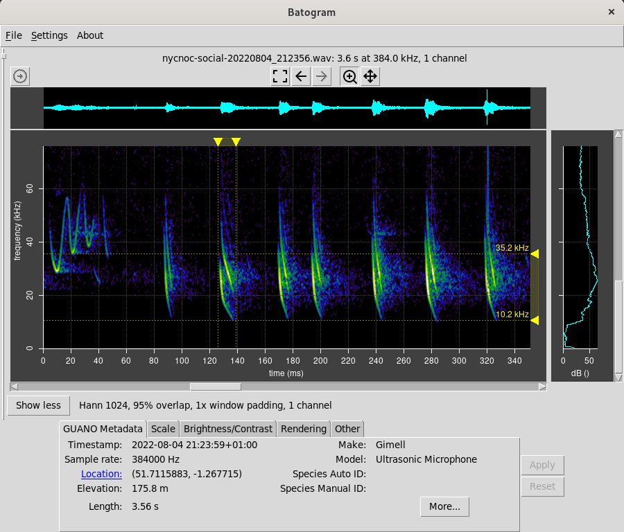
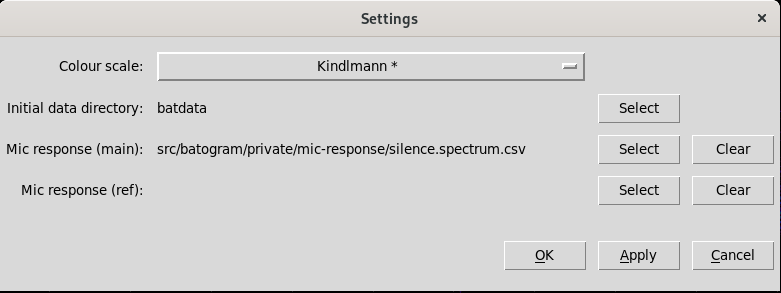
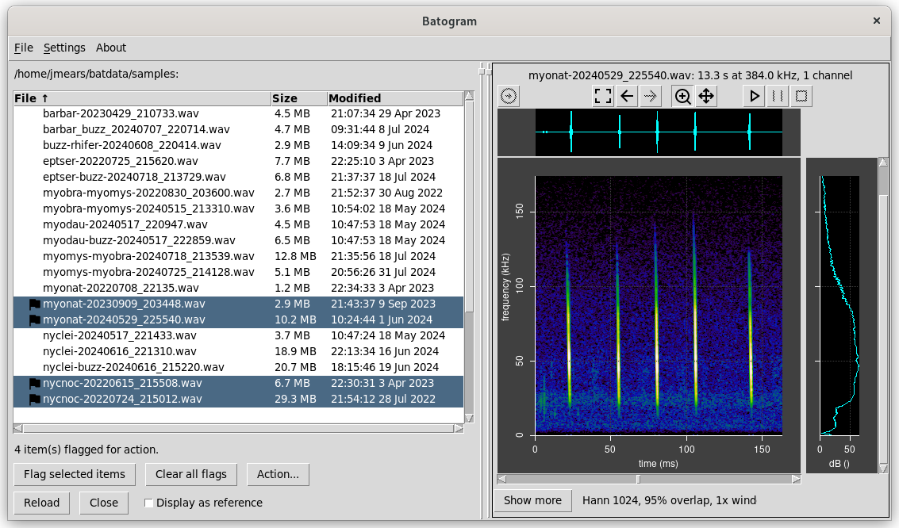

 Batogram Usage
===============

Panning, Scrolling and Zooming
------------------------------

There are various options for viewing the part of the spectrogram of interest.

### Navigation Buttons

Use the buttons above the spectrogram together with the mouse and "shift" button to pan, scroll and
zoom the spectrogram.

* The **home** button zooms right out to include the entire range of the file. If the data
file is very large, you may need to zoom back in spome way before the spectrogram
is rendered.
* The **left** and **right** arrows move back and forth through the recent history of different pans, scrolls
and zooms. This can be useful, for example, if you have zoomed in too far and want to revert
to the previous view.

The next two buttons select function of the left mouse button: zoom or pan. See the next section.

### Mouse Navigation

The mouse provides the most flexible way to navigate the spectrogram.

The left mouse button depends on the mode selected above: zoom or pan.

* In **zoom** mode, the left mouse button is used to zoom into a region of interest by clicking
and dragging. The type of zoom is selected automatically depending
on the direction of drag: vertical, horizontal or rectangular region zoom. Hold down shift to prevent
automatic selection.
* In **pan** mode, the left mouse button can be used to pan or scroll. The type
depends on the direction of drag: vertical, horizontal or oblique.

Hold down shift in either mode to lock the type of zoom or pan.

Dragging with middle mouse button can also be used to pan.

If you have a mouse wheel, this can be used to zoom and out, centred on the current position
of the mouse pointer. Holding down the shift key at the same time freezes the frequency range while 
zooming the time range; likewise holding down the ctrl key (possibly the also the Apple key) freezes the
time range while zooming the frequency range.

### Keyboard Navigation

* The left and right arrow keys pan the spectrogram parallel to the time axis.
* The page up and page down keys scroll the spectrogram parallel to the freqency axis.
* The up and down arrow keys expand or compress the time range, leaving the frequency range unchanged.
The range range is selected from a predefined set (1/2/5/120/20/50/etc ms per 100 pixels).

Use shift together with a navigation key to apply larger increments.

### Scoll Bar Navigation

The spectrogram can also be panned and scrolled using the scroll bars in the usual way.

Show More/Show Less
-------------------

Click the **Show more** button below the spectrogram to view more details and have access to manual
settings.

### GUANO Metadata

The GUANO metadata tab shows GUANO metadata if present in the data file. If the location coordinates
are present, you can click the blue Location link to open your web browser in Google Maps
at that location. To see *all* the GUANO metdata present, click the **More** button.

### Scaling

The Scaling tab allows you to manually enter axis ranges and apply axis ranges in the obvious way.

Check boxes allow you to show or hide the grid and profile graph. Hiding the profile graph speeds
up screen rendering somewhat. 

If you check "zero based time", the time axis will always start from zero, however you pan or zoom
the spectrogram. This is makes the time axis a little easier to read, but is a matter of taste.

You may enable time or frequency markers to allow values and ranges to be conveniently read off a graph,
as shown below. Draw the yellow markers to move the datum lines.

### Brightness and Contrast

The Brightness/Contrast tab allows you to determine how spectral power is mapped to
colours in the spectogram. There are three modes:
* **Auto** mode will typically do what you want, and is selected whenever a new file is opened.
* **Manual** mode allows you to enter a specific range in dB.
* If you select **Interactive** and press **Apply**, you will enter interactive mode. You can now
drag markers and use the mouse wheel in the histogram; the spectrogram will refresh as you go.

### Rendering

The Rendering tab allows you to control in detail how the raw file data is rendered to
a spectrogram:
* FFT samples determines the window width for the Fourier Transform, allowing to trade
off time and frequency resolution as you wish. Auto mode will select one for you automatically based on the
screen aspect ratio.
* Various FFT window types are available. The default is Hann, which is a common general purpose
window. Use Google to find out more about this. The window type makes little difference
unless you are zoomed right on a CF section of call.
* FFT overlap determines the overlap of adjacent FFT windows, allowing you to trade off smoothness
versus speed of rendering. Auto mode chooses a value for you based in screen resolution.
* The window padding factor allows you to pad the window with zeros. This increases freqeuency resolution.
* Spectrogram type allows you to choose between a standard spectrogram and a higher resolution reassignment
spectrogram. [Reassignment spectrograms](https://en.wikipedia.org/wiki/Reassignment_method) are slower to calculate
and need more memory to process, so it is best to zoom in the region of interest before selecting this option.
Reassignment spectrograms and are bested suited to data with high signal to noise ratio and with no overlapping
calls, otherwise artifacts may result. Reassingment spectrograms are best viewed with Image Interpolation set to None
and with Window Padding set to 4 or 8. You may also want to adjust the brightness/contrast settings. See the example
below.
* Image interpolation determines how FFT pixels are mapped to screen pixels,
allowing you to trade off smoothness of image versus speed of rendering.

To achieve fastest rendering at the price of lower image quality, zoom right into the region of
interest, choose a small FFT window, low overlap, and no interpolation.

Here is an example of a reassignment spectrogram compared with a standard spectrogram of the
same raw data, illustraing the higher resolution of the reassigment spectrogram for data with high signal to
noise ratio.

### Other

The Other tab includes miscellaneous options.

* Multichannel data determines how data files with more with one channel of data will be handled.
You can choose to combine them all or by selecting a specific channel. Channel combination
is done by summing the spectrogram power amplitudes after phase is discarded to avoid interference effects.
If you select a channel that is not present, any channels that are present will be summed instead.
* BatGizmo settings are specific to the BatGizmo detector.
* The Sample Rate field allows you to override the sample rate inferred from the wav file and metadata
settings (which in rare cases are not correct). You may need to do this if you notice that the frequence
range in the spectrogram is not what you expect.

## Audio Playback

Audio playback is controlled by the playback buttons above the spectrogram:
. These start, pause and stop playback.

Audio playback is based on the time range currently visible in the spectrogram. So, zoom in to reduce
the playback time range and zoom out to increase it. The play, pause and stop buttons work in the obvious way.

Playback settings are displayed when the play button is clicked:

* Heterodyne playback simulates the sound that would be heard from a classic heterodyne bat
detector. Choose a reference frequency close to and a little below the frequency of the calls
you are interested in.
* Time division playback slows down the recording by a selectable factor, so that the pitch is reduced to be
audible.
* Direct playback plays the recording unmodified, other than decimation mentioned below, so that any audio sounds
can be heard.

All the playback methods reduce the audio sample rate by decimation to a nominal 48 kHz. This is exact if
the original sample rate is a multiple of 48 kHz, otherwise it is approximate. The resultant
audio stream can be written to a .wav file if required, so it can be shared and played in other software.

"Auto volume control" applies a gain factor based on the initial 20s of data, designed to match
that data to 80% of the maximum raw signal range. If the loudest part of your data is after 20s, it
may be distorted in playback. In that case, uncheck this feature.

Settings
--------

A settings dialog can be access from the top menu bar. This contains infrequently changed
settings that apply to the entire application.

* _Colour scale_ allows you to choose between different colour maps. The most successful ones are marked
with an asterisk. Selection is a matter of taste and eyesight.
* _Initial data directory_ determines the directory that File Open dialogs start from. Typically you
should point this where you store your data files.
* Mic response (main and ref) allows you to correct for microphone frequency response, by specifying a
response for the main and reference spectrograms. More on the file format is provided [here](mic-response.md).

Browsing a folder of audio files
--------------------------------

Use the File | Open folder menu option to open a folder of audio files. This results in the audio
files being listed in the browser panel.

Click on a file in the list to view it. It will be loaded into the main or reference spectrogram view depending on 
whether you have checked "Display as reference".

Click on Reload to reload the list of items, for example the if they have changed on disk.

You can perform actions on items as follows:
* Select one or more items in the list using mouse clicks combined with shift and ctrl as required.
* Click the "Flag selected items" button to flag or unflag them.
* Repeat the first two steps until all you have flagged all the items you want to take an action on.
* Click the "Action..." button. 

Actions may be performed on flagged items as selected. This can be useful as part of the process
of manually reviewing a set of recordings. Unwanted records can be deleted, other recordings can
be flagged and moved to folders according to their content, and so forth.

Side by Side Comparison
-----------------------

Batogram actually allows two data files to be viewed side by side at the same time. This capability 
is intended to allow comparison between data under analysis and known reference data.

You can open a second spectrogram views using the **File | Open reference** menu option. The new file will be opened
on the left side of the screen as shown below.

It's best to view the reference and main spectrogram at the same scale to allow for visual comparison.
You can synchronize the axis scaling to and fro between the main and reference spectrograms using the
left and right buttons near the top corners of the two spectrograms:

Apart from scaling synchronization, the two spectograms have fully independent settings that can be
accessed via the relevant **Shore more** button.

Adjust the relative size of the two spectrograms by clicking and dragging the vertical divider as required.
