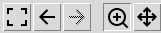

 Batogram Usage
===============

Panning and Zooming
-------------------

Use the buttons above the spectrogram together with the mouse and "shift" button to pan, scroll and
zoom the spectrogram.

The **home** button zooms right out to include the entire range of the file. If the data
file is very large, you may need to zoom back in spome way before the spectrogram
is rendered.

The **left** and **right** arrows move back and forth through the recent history of different pans, scrolls
and zooms. This can be useful, for example, if you have zoomed in too far and want to revert
to the previous view.

The next two buttons select function of the left mouse button: zoom or pan:
* In **zoom** mode, the left mouse button is used to zoom into a region of interest by clicking
and dragging. The type of zoom is selected automatically depending
on the direction pof drag: vertical, horizontal or rectangular region zoom. 
* In **pan** mode, the left mouse button can be used to pan or scroll. The type
depends on the direction of drag: vertical, horizontal or oblique.

In either mode, hold down the shift button as you drag to lock the current zoom type.

The spectrogram can also be panned and scrolled using the scroll bars.

Spectrogram Settings
--------------------

Click the **Show more** button below the spectrogram to view more details and have access to manual
settings.

### GUANO Metadata

The GUANO metadata tab shows GUANO metadata if present in the data file. If the location coordinates
are present, you can click the blue Location link to open your web browser in Google Maps
at that location. To see *all* the GUANO metdata present, click the **More** button.

### Scaling

The Scaling tab allows you to manually enter axis ranges and apply axis ranges in the obvious way.

## Brightness and Contrast

The Brightness/Contrast tab allows you to determine how spectral power is mapped to
colours in the spectogram. There are three modes:
* **Auto** mode will typically do what you want, and is selected whenever a new file is opened.
* **Manual** mode allows you to enter a specific range in dB.
* If you select **Interactive** and press **Apply**, you will enter interactive mode. You can now
drag markers and use the mouse wheel in the histogram; the spectrogram will refresh as you go.

### Rendering

The Rendering tab allows you to control in detail how the raw file data is rendered to
a spectrogram:
* FFT samples determines the window width for the Fourier Transform, allowing to trade
off time and frequency resolution as you wish. Auto mode will select one for you automatically based on the
screen aspect ratio.
* FFT overlap determines the overlap of adjacent FFT windows, allowing you to trade off smoothness
versus speed of rendering. Auto mode chooses a value for you based in screen resolution.
* Various FFT window types are available. The default is Hann, which is a common general purpose
window. Use Google to find out more about this. The window type makes little difference
unless you are zoomed right on a CF section of call.
* Image interpolation determines how FFT pixels are mapped to screen pixels,
allowing you to trade off smoothness of image versus speed of rendering.

To achieve fastest rendering at the price of lower image quality, zoom right into the region of
interest, choose a small FFT window, low overlap, and no interpolation.

Side by Side Comparison
-----------------------

Batogram actually allows two data files to be viewed side by side at the same time. This capability 
is intended to allow comparison between data under analysis and known reference data.

You can open a second spectrogram views using the **File | Open reference** menu option. The new file will be opened
on the left side of the screen as shown below.

It's best to view the reference and main spectrogram at the same scale to allow for visual comparison.
You can synchronize the axis scaling to and fro between the main and reference spectrograms using the
left and right buttons near the top corners of the two spectrograms:

Apart from scaling synchronization, the two spectograms have fully independent settings that can be
accessed via the relevant **Shore more** button.

Adjust the relative size of the two spectrograms by clicking and dragging the vertical divider as required.
