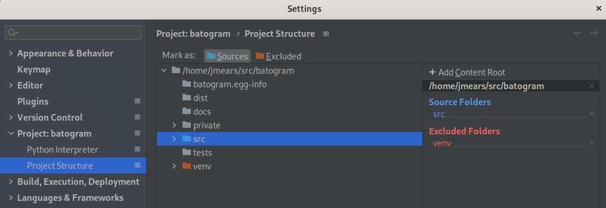
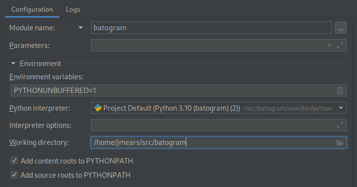

Notes for the Developer
=======================

How to Run and Debug
--------------------

Batogram is a Python package, and intended to be run as a package. That means you need the package to be present
somewhere in your PYTHONPATH, and you need to run it like this:

    python3 -m batogram

There are several ways to achieve this. The most obvious is to install the Batogram package using pip, 
into a virtual environment. The PYTHONPATH in the environment then automatically includes the location of the 
batogram code. This is not convenient for development though, when you want a copy of the source in your working
directory, and need to make changes and try them out immediately.

To debug and develop the source code conveniently, set up an environemt as follows. You will need at least Python
version 3.9. Change to a suitable directory, and then:

    python3 -m venv venv
    source venv/bin/activate
    git clone --depth=1 git@github.com:jmears63/batogram.git
    cd batogram
    pip install pip --upgrade   # Good practice.
    pip install -r requirements.txt

Then you can run the code directly as a module. You need to be in the src directory so that Python
can find the module:

    cd src
    python3 -m batogram   # Run the code as a module, NOT as a script:

Developing using PyCharm
------------------------

I generally do development using [PyCharm](https://www.jetbrains.com/pycharm/). Some things
need to be configured for PyCharm to be able to run and debug from the environment:

* Set up a basic development environment as outlined above.
* Open a new PyCharm project based on the top level directory - that's the directory that contains README.md.
* We need the src directory to be a source root, so navigate to File | Settings, and expand the node
for the batogram project. Select "src" in the source tree, and make it a source root by clicking on
"Sources", above the source tree. The src folder will turn blue:

* Go to Run | Edit configurations.
  * We need to run the code as a module, not a script, so click on the dropdown near
  the top of the configuration options and change it from "script path" to "Module name", and enter "batogram":
  * We need the src directory to be in the PYTHONPATH, make sure "Add source roots to PYTHONPATH" is ticked
  (checked):

You can now run and debug the code interactively from PyCharm in the usual way.

Developing using Visual Studio Code
-----------------------------------

Microsoft's [VS Code](https://code.visualstudio.com/) is a convenient and lightweight cross platform
development environment.

* Set up a basic development environment as outlined above.
* Install the Microsoft Python extension in VS Code, if it is not already installed.
* Use "File | Open Folder" to open a Batogram project from the code you cloned from github.
* Use "Run | Add Configuration" to create a configuration that runs batogram 
as a module, and sets the working directory so the code module can be found
by VS Code. The resulting launch.json will look something like this (pay attention to "module" and "cwd"):
  
  
    Source code
    {
        "version": "0.2.0",
        "configurations": [
            {
                "name": "Python: Module",
                "type": "python",
                "request": "launch",
                "module": "batogram",
                "justMyCode": true,
                "cwd": "src"
            }
        ]
    }